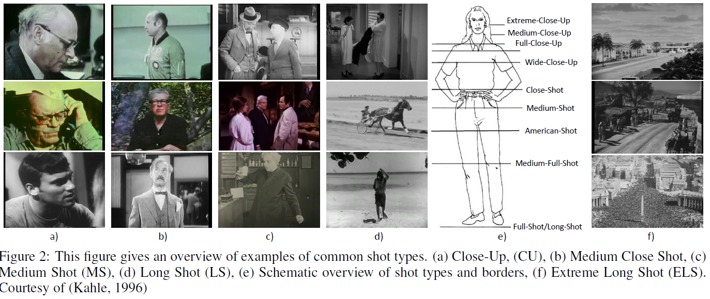
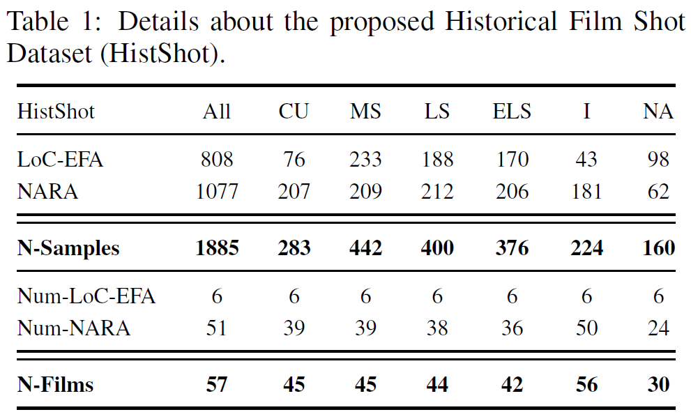
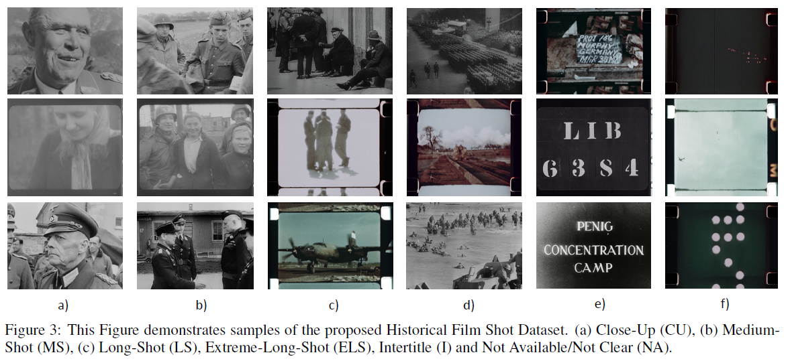
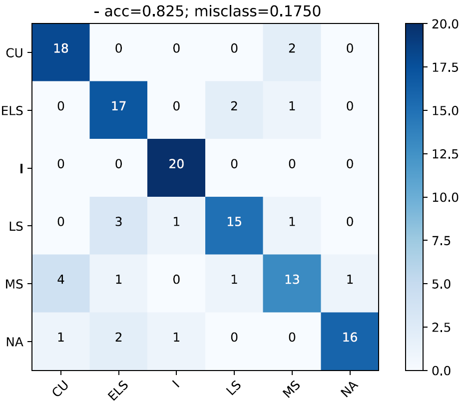
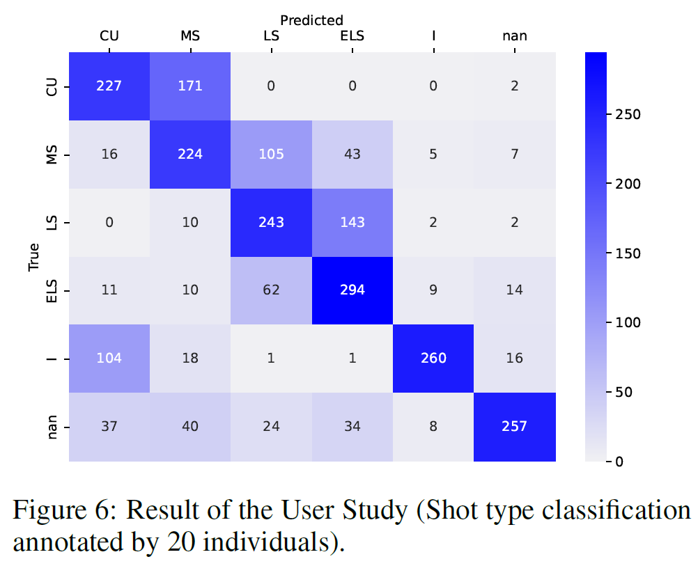

# Historical Film Shot Dataset (V1)

Paper: HistShot: A Shot Type Dataset based on Historical Documentation during WWII

Conference title: 
International Conference on Pattern Recognition Applications and Methods (ICPRAM 2022)

## Description

Automated shot type classification plays a significant role in film preservation and indexing of film datasets. In this paper a historical shot type dataset (HistShot) is presented, where the frames have been extracted from original historical documentary films. A center frame of each shot has been chosen for the dataset and is annotated according to the following shot types: Close-Up (CU), Medium-Shot (MS), Long-Shot (LS), Extreme-Long-Shot (ELS), Intertitle (I), and Not Available/None (NA). The validity to choose the center frame is shown by a user study. Additionally, standard CNN-based methods (ResNet50, VGG16) have been applied to provide a baseline for the HistShot dataset.

## Download
Zenodo: 

## Dataset Details

|  |  |
| ----------- | ----------- |
|  |  |

Details can be found in the paper.

## Baseline Results

|  |  |
| ----------- | ----------- |
|  |  |

The left confusion matrix demonstrates the results of a VGG16 architecture trained on the HistShotDS (V1) and tested on the user-study test set. The visualization on the right shows the results of the user study (manual assessmment of 20 different individuals). Details can be found in the paper.

## Acknowledgement

Visual History of the Holocaust: Rethinking Curation in the Digital Age \cite{vhh}. This project has received funding from the European Union’s Horizon 2020 research and innovation program under the Grant Agreement 822670. Special thanks to all participants (film experts and non-experts) of the survey.

## References
 	
VHH-MMSI: [https://vhh-mmsi.eu/](https://vhh-mmsi.eu/)

VHH-project Page: [https://www.vhh-project.eu/](https://www.vhh-project.eu/)

